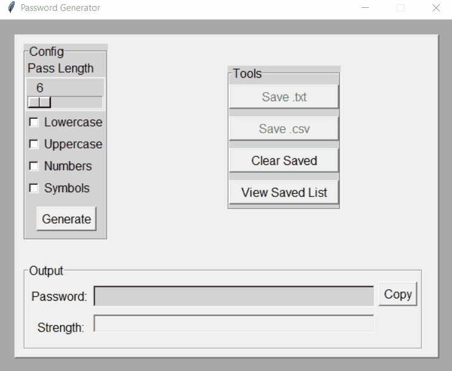

# Password Generator

**Password Generator** is a secure, GUI-based Python application built with Tkinter that allows you to generate customizable passwords with control over length, character types, and strength. It also includes a tool panel for saving and managing your generated passwords.

---

## Features

- Adjustable password length with slider
- Toggle options for:
  - Lowercase
  - Uppercase
  - Numbers
  - Symbols
- Real-time password strength meter
- Copy to clipboard
- Save passwords to `.txt` or `.csv` with timestamps
- View saved passwords folder
- Clear saved passwords with confirmation
- Clean, organized layout using Tkinter frames
- Exportable as a standalone `.exe` with custom icon

---

## How It Works

1. Choose your desired password length.
2. Check the character types you want included.
3. Click **Generate** to create a password.
4. Click **Copy** to save it to clipboard.
5. Save the password to `.txt` or `.csv` via the **Tools** panel.
6. View or clear saved lists as needed.

---

## Demo

Here’s the Password Generator in action:



---

## Running the App

### Option 1: As a Python script

Make sure you have Python 3 installed, then run:

```bash
python PasswordGenerator.py
```

### Option 2: As a standalone `.exe`

You can download the latest `.exe` release from the [Releases](../../releases) section.

No Python installation required.

---

## Compatibility

- ✅ Windows 10/11 (Python or `.exe`)
- ✅ Tested with various combinations of character sets

---

## License

This project is licensed under the [MIT License](LICENSE).
